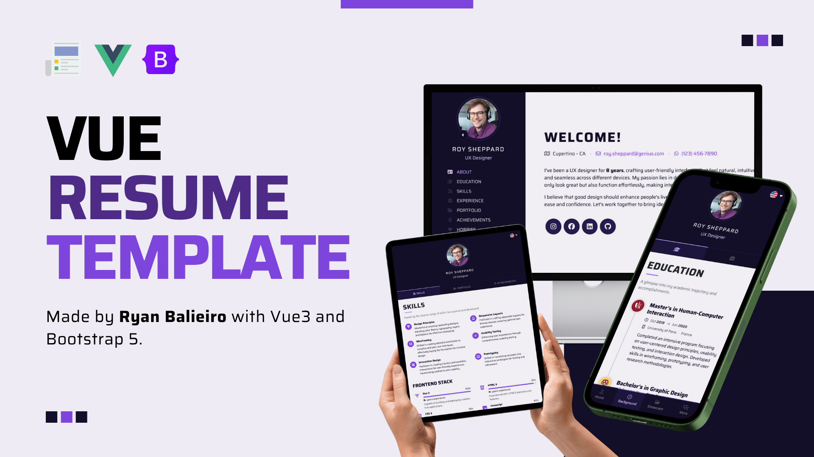
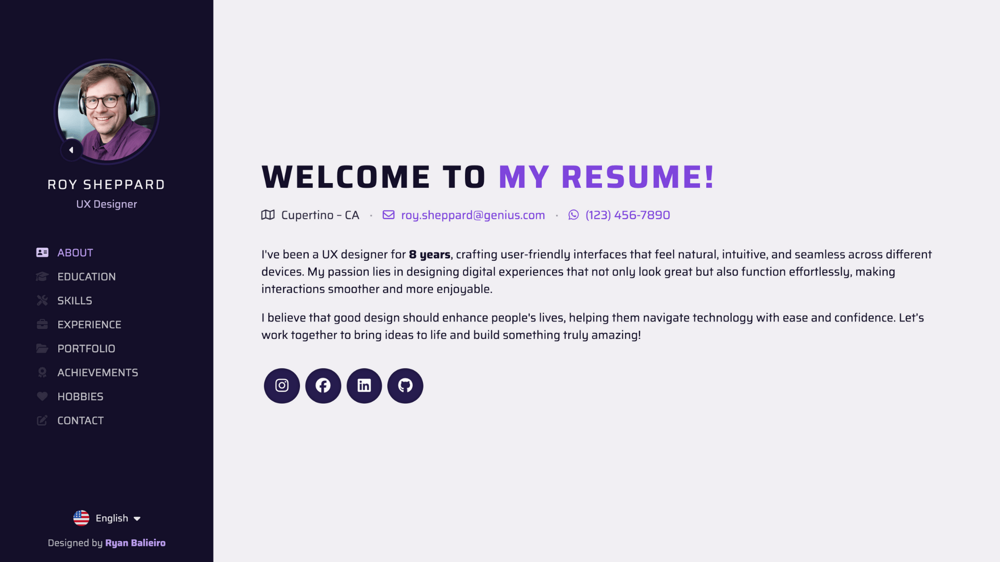
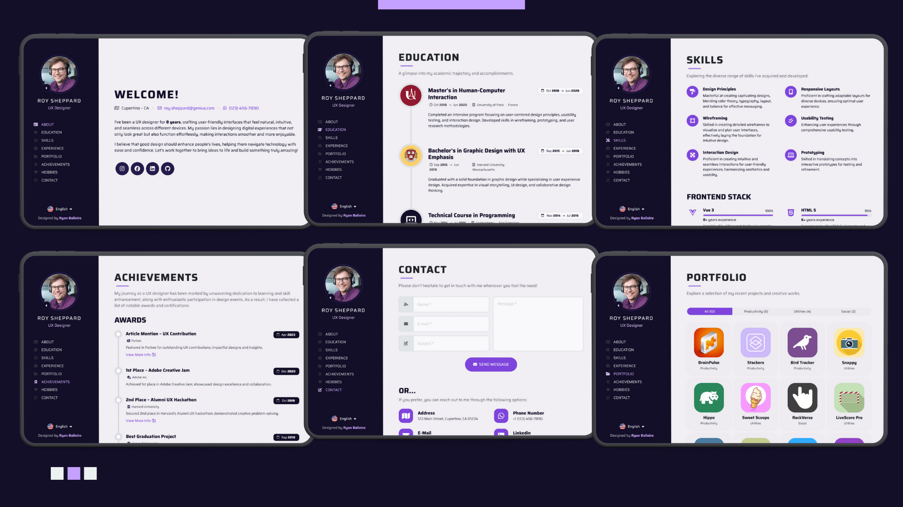
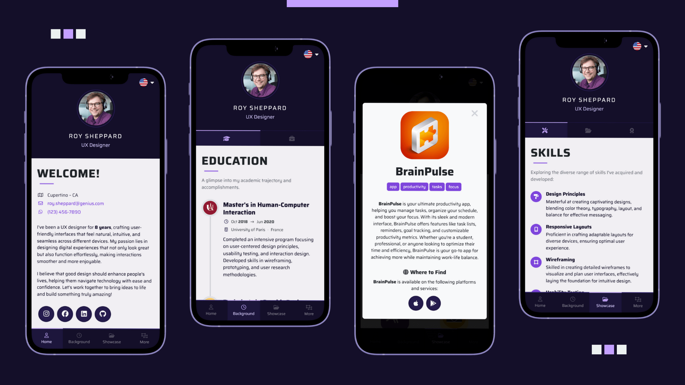

#  [Vue Resume Template](https://ryanbalieiro.github.io/vue-resume-template/) by Ryan Balieiro

A clean and minimal template for building a resume landing page, powered by **Vue 3** (Composition API) and **Bootstrap 5**.



Key features:
- Uses Vue3 **Composition API**.
- **Six unique section layouts** to showcase your work experience, education, skills, projects, and more.
- Adaptive navigation: **a fixed sidebar** for desktops and **a tabbed layout** for mobile.
- Built-in **multi-language** support.
- Emails with **EmailJS** – no backend needed!
- **Super easy** to customize!

## Live Preview

Here's a list of live versions of the template:

| #     | Version                | Description                                               | URL                                                               |
|-------|------------------------|-----------------------------------------------------------|-------------------------------------------------------------------|
| 🟣    | Roy Sheppard (default) | Latest deployment of the template here on GitHub pages.   | [Preview](https://ryanbalieiro.github.io/vue-resume-template/)    | 
| 🟢    | Alana Richard          | An example of how the template can be customized.         | [Preview](https://rbtutorials.github.io/alana-richard-vue-resume) |         

## Layout and concept

### 1. Base layout
The theme has a clean, minimalist design with a nice mix of purple shades that gives it a fresh, stylish vibe.



### 2. Desktop Screenshots
On desktop, it has a simple one-page layout with a fixed sidebar, so users can easily scroll through the sections.



### 3. Mobile Screenshots
On mobile, the layout groups the sections into categories and transforms into a tabbed interface with a bottom navigation.



## Getting Started

1. Clone the repo:
```
git clone https://github.com/ryanbalieiro/vue-resume-template
```

2. Go to the project's root folder and use npm to install all required components:
```
npm install
```

3. Launch the project in developer mode:
```
npm run dev
```

4. (Optional) If you'd like to clear all the portfolio data and begin with a blank page with no sections, run the command below:
```
npm run resume:clear
```

5. (Optional) If you want to temporarily deactivate the preload animation during theme adjustments, go to `public/data/settings.json` and set the `preloaderEnabled` flag to false.

## Configuration Tutorial

Watch this step-by-step video tutorial to see exactly how to configure your resume:

| #   | Title                                    | Watch                                                                    |
|-----|------------------------------------------|--------------------------------------------------------------------------|
| 1   | Setting up the project                   | [Watch on YouTube](https://www.youtube.com/watch?v=QvQQK81xljw&t=0m00s)  |
| 2   | Title and colors                         | [Watch on YouTube](https://www.youtube.com/watch?v=QvQQK81xljw&t=1m31s)  |
| 3   | Settings, strings and profile            | [Watch on YouTube](https://www.youtube.com/watch?v=QvQQK81xljw&t=4m20s)  |
| 4   | Categories and sections                  | [Watch on YouTube](https://www.youtube.com/watch?v=QvQQK81xljw&t=7m37s)  |
| 5   | ArticleProfile                           | [Watch on YouTube](https://www.youtube.com/watch?v=QvQQK81xljw&t=10m33s) |
| 6   | ArticleTimeline                          | [Watch on YouTube](https://www.youtube.com/watch?v=QvQQK81xljw&t=14m12s) |
| 7   | ArticleSkills                            | [Watch on YouTube](https://www.youtube.com/watch?v=QvQQK81xljw&t=18m00s) |
| 8   | ArticlePortfolio                         | [Watch on YouTube](https://www.youtube.com/watch?v=QvQQK81xljw&t=22m38s) |
| 9   | ArticleThreads and ArticleContactOptions | [Watch on YouTube](https://www.youtube.com/watch?v=QvQQK81xljw&t=25m36s) |
| 10  | ArticleContactForm                       | [Watch on YouTube](https://www.youtube.com/watch?v=QvQQK81xljw&t=29m44s) |
| 11  | Deploying on GitHub Pages                | [Watch on YouTube](https://www.youtube.com/watch?v=QvQQK81xljw&t=34m05s) |
| 12  | Extra deployment instructions            | [Watch on YouTube](https://www.youtube.com/watch?v=QvQQK81xljw&t=36m20s) |   

For step-by-step setup and deployment instructions, you can also check out the following docs:
- [CONFIGURATION.md](./docs/CONFIGURATION.md) – learn how to configure and customize the project.
- [DEPLOYMENT.md](./docs/DEPLOYMENT.md) – short guide on deploying the project.

## About

This template was created by and is maintained by **[Ryan Balieiro](https://ryanbalieiro.com/)**.

It is based on the [Bootstrap](https://getbootstrap.com/) framework created by Mark Otto and Jacob Thorton; and the [Vue](https://vuejs.org/) framework created by Evan You.

Additional frameworks and plugins used include:
- **Font Awesome**: A library of free vector icons.
- **EmailJS**: A free service that allows you to send emails using JavaScript.

## Copyright and License

Code released under the [MIT](https://opensource.org/license/mit) license, providing complete freedom for utilization. Feel free to enhance and adapt it to suit your needs.

Oh... and if you like this template, don't forget to **give it a ⭐** :)