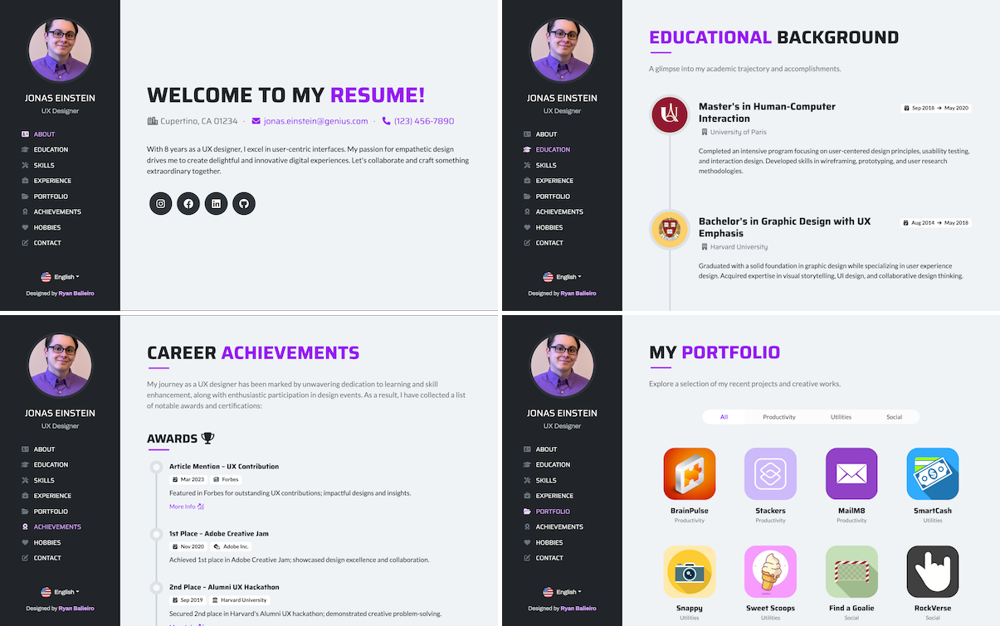
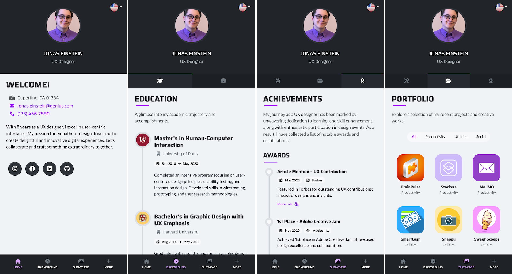
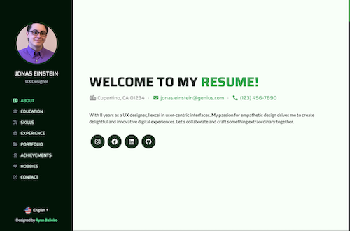

# [Vue Resume Template](https://ryanbalieiro.github.io/vue-resume-template/) by Ryan Balieiro

This theme offers a simple and clean design tailored for creating user-friendly website resumes or CV landing pages. It's built using Vue 3.0 (Composition API) and Bootstrap 5, presenting a cohesive one-page layout that blends functionality and aesthetics.

Key features:
- An anchored fixed side navigation bar for smooth scrolling through the page.
- Six custom section layouts showcasing work experience, educational background, professional skills, portfolio, and more.
- A tailored navigation mode specifically for mobile screens.
- Multi-language translation support included.
- Using Vite for faster build times and seamless integration.

## Status

[](https://raw.githubusercontent.com/StartBootstrap/startbootstrap-agency/master/LICENSE)
[](https://www.npmjs.com/package/startbootstrap-agency)

## Preview

Check out a live version of the template **[here](https://ryanbalieiro.github.io/vue-resume-template/).**

### 1. Desktop Screenshots



### 2. Mobile Screenshots



## Getting Started

1. Clone the repo:
```
git clone https://github.com/ryanbalieiro/vue-resume-template
```

2. Navigate to the root directory of the project and install all dependencies with npm:
```
npm install
```

3. Run the project in developer mode:
```
npm run dev
```

4. To temporarily deactivate the preload animation during theme adjustments, navigate to `public/data/settings.json` and modify the following field:

```
 "preloaderEnabled": false
```

## Template Customization

### 1. Changing the content

The application content, including texts and images, is conveniently stored within the `public/` folder. Inside this directory, you'll come across two folders:

- `public/data` ➔ This directory hosts a collection of JSON files that house the entirety of the application's content.
- `public/images`➔ Here, you'll find a collection of icons and photos that the application utilizes.

You can personalize the app's content by modifying the data within these two folders according to your preferences. 

### 2. Quickly customizing the colors

Adjusting the theme colors can be done quickly by editing the variables found in `src/scss/_variables.scss`. To illustrate, a variation of the theme featuring shades of green can be created by modifying the following variables:

```scss
$primary: #13a452; /** changing the 'primary' color to green **/
$dark: #021307; /** changing the 'dark' color to a dark shade of green **/
$background-color: #f8fff8; 
```

Resulting in:



### 3. Adding and removing languages

To add or remove languages, open `public/data/settings.json` and modify the `supportedLanguages` field as needed. Use the `default` property to specify the fallback language that should be used if the application doesn't support the user's preferred language.

```json
{
    "supportedLanguages": [
        {
            "name": "English",
            "id": "en",
            "flagUrl": "images/flags/en.png",
            "default": true
        },

        {
            "name": "日本語",
            "id": "ja",
            "flagUrl": "images/flags/ja.png"
        }
    ]
}
```

The `public/images/flags/` folder already contains a collection of flags for commonly used languages. If you require a specific flag icon that isn't there, you can download it at no cost from this [source](https://www.flaticon.com/packs/countrys-flags).

To deactivate support for multiple languages, keep only a single language within the array. This will automatically hide the language picker menu.

### 4. Adding, removing and reordering sections

Inside the `public/data/sections.json` file, you will come across two arrays: one for sections and the other for categories. Every section in the application should be linked to a corresponding category. These categories are used in grouping sections within the mobile navigation.

Adding, removing or reordering the portfolio sections and categories can be achieved by making modifications to these arrays as needed.

For localizing the section and category titles, ensure that the `id` of each section and category has a corresponding translation in `public/data/strings.json`.

*public/data/strings.json*
```json 
{
    "en": {
        "section1_id": "Section 1 ID",
        "section2_id": "Section 2 ID",
        "section3_id": "Section 3 ID"
    },
    
    "ja": {
        "section1_id": "セクション1 ID",
        "section2_id": "セクション2 ID",
        "section3_id": "セクション3 ID"
    }
}
```

### 5. Customizing a section

Each section entry in `public/data/sections.json` comprises the following fields:

```json 
{
    "id": "experience",
    "categoryId": "background",
    "component": "TimelineSection",
    "jsonPath": "data/sections/experience.json",
    "faIcon": "fa-solid fa-briefcase"
}
```

- ***id*** ➔ A unique identifier for the section, also used as a key to fetch the section's name within `strings.json`
- ***categoryId*** ➔ Specifies the category to which the section belongs.
- ***component*** ➔ Indicates the Vue component responsible for rendering the section.
- ***jsonPath*** ➔ A reference pointing to the JSON file containing the section's content.
- ***faIcon*** ➔ The FontAwesome icon associated with the section.

To modify the content of a section, open and edit its respective JSON file. Keep in mind that each Vue component may require a specific JSON structure. For proper structuring of section JSON files, refer to the existing ones as a guide.

### 6. Localizing fields

To stay in line with the project's guidelines, put the translations for your static texts into the `public/data/strings.json` file. This file acts as a hub for all your global localization needs. For section and component-specific content, create a `locales` field to encapsulate the corresponding translations.

Each localizable object adheres to the following structure:

```
{
    "locales": {
        "en": {
            "hello": "Hello!",
            "age: "Age"
        },
        
        "es": {
            "hello": "Hola!",
            "age": "Edad"
        },
        
        (...)
    }
}
```

### 7. Adding functionality to the contact form

Making the contact form functional requires the creation of your own server-side implementation within the `ContactForm.vue` file. Please note that the current template only includes the client-side implementation, accompanied by a simulated delay using a placeholder timeout to mimic the waiting period for requests:


```js
const _sendMessage = (values) => {
    const feedbackView = layout.getFeedbackView()
    feedbackView.showActivitySpinner(data.getString("sendingMessage") + "...")
    submitAttempts++

    /** The message sending logic goes here... **/
    //setTimeout(() => {
    //    if(submitAttempts % 2 !== 0) {
    //        _onMessageSent()
    //    }
    //    else {
    //        _onMessageError()
    //    }
    //}, 1000)
    /** ************************************** **/
}
```


To disable the contact form, open `public/data/settings.json` and set the `contactFormEnabled` flag to false:

```
 "contactFormEnabled": false
```

## Building for production

Open the `vite.config.js` file and set the base directory for your application. This setting defines the main path that your website will be hosted under.

```js
export default defineConfig({
  base: '/vue-resume-template/',
  plugins: [vue()],
})
```

In simple terms, if you consider GitHub hosting the GitHub Pages site for this repo at the URL `https://ryanbalieiro.github.io/vue-resume-template/`, the correct base directory to set is `/vue-resume-template/`. This ensures that the application's resources are correctly loaded and linked when accessed from this URL.

If you're deploying to Netlify or your own custom domain where your website is located at the root, you can leave the `base` setting as `'/'`.

To compile your project for production, execute:

```
npm run build
``` 

This command triggers a series of processes that package your code, assets, and other necessary files, ultimately creating a production-ready version of your project. After running the command, you'll find the compiled files within the `dist` folder. This is the folder you should use for deploying your application to a live server or hosting platform.


If your deployment is targeted at GitHub Pages, ensure to run the following command post the build process:

```
npm run deploy
```

This step serves as a solution to the problem discussed in detail at https://stackoverflow.com/questions/48521177/404-when-reloading-a-vue-website-published-to-github-pages. By following this workaround, we can prevent the application from encountering a 404 error upon reloading specific routes within the app that are not the homepage.

## About

This template was created by and is maintained by **[Ryan Balieiro](https://ryanbalieiro.com/)**.

It's based on the [Bootstrap](https://getbootstrap.com/) framework created by Mark Otto and Jacob Thorton; and the [Vue](https://vuejs.org/) framework created by Evan You.

## Copyright and License

Code released under the [MIT](https://github.com/StartBootstrap/startbootstrap-agency/blob/master/LICENSE) license, providing complete freedom for utilization. Feel free to enhance and adapt it to suit your needs.